# Elegant-Markdown-Style

A self-use Markdown style (suitable for study notes, documents), used with [VSCode](https://code.visualstudio.com/) + [Markdown Preview Enhanced plug-in](https://github.com/shd101wyy/markdown-preview-enhanced).

The inspiration for the style comes mainly from the following websites:
- [Google Protocol Buffers Doc](https://developers.google.com/protocol-buffers)
- [MSDN Doc](https://learn.microsoft.com/en-us/dotnet/api/system?view=net-7.0)
- [LearnOpenGL CN](https://learnopengl-cn.github.io/)

p.s. This repository will update occasionally, and the pic below may not be updated in time.


## Install

### Install Fonts
- LXGW WenKai
- LXGW WenKai Screen
- Raleway
- Noto Sans
- Noto Sans Symbols2
- Times New Roman
- Cascadia Code
- Vintama Shadow (Left Marker of Blockquote)

These fonts may be found on Github or [Google Fonts](https://fonts.google.com/).

Some fonts may be pre-installed on your system, go to the Fonts folder (Windows) or Font Book.app (macOS) to check.

### Install Style
Please make sure you have installed Markdown-Preview-Enhanced Plugin, how to install will not be explained here.

- Open VSCode
- <kbd>Ctrl</kbd>+<kbd>Shift</kbd>+<kbd>P</kbd> or <kbd>Cmd</kbd>+<kbd>Shift</kbd>+<kbd>P</kbd>
- Enter "Customize CSS" and select the first option, it would open a file called `style.less`
- Delete **everything** in the `style.less`
- Copy **everything** from [thin-style](src/Thin-Style.less) (or [black-style](src/Black-Style.less))
- Paste into `style.less`
- Save file


## Effect

The pictures shown below are screenshots from [sample.md](sample/sample.md) rendering on my macbook. Only the effect is shown here, how they are written can refer to the source code.

### Header

p.s. This style only use up to four levels of headings

**Header1**:
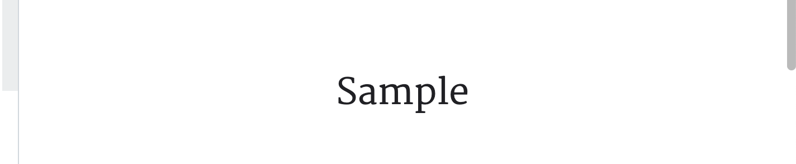

**Header2**:
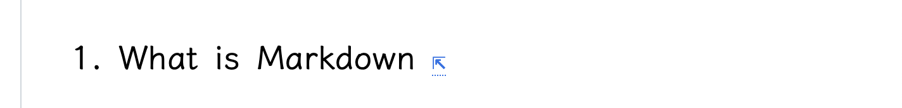

**Header3**:
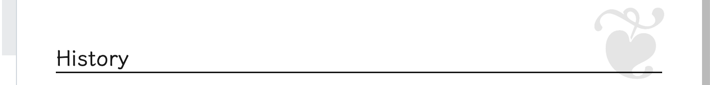

**Header4**:
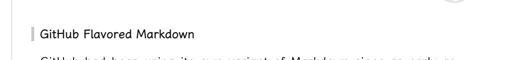

### Paragraph


Red word is **bold** text. Green word is concept which appear in context first time, and the following content always be definition of the concept.

### Table
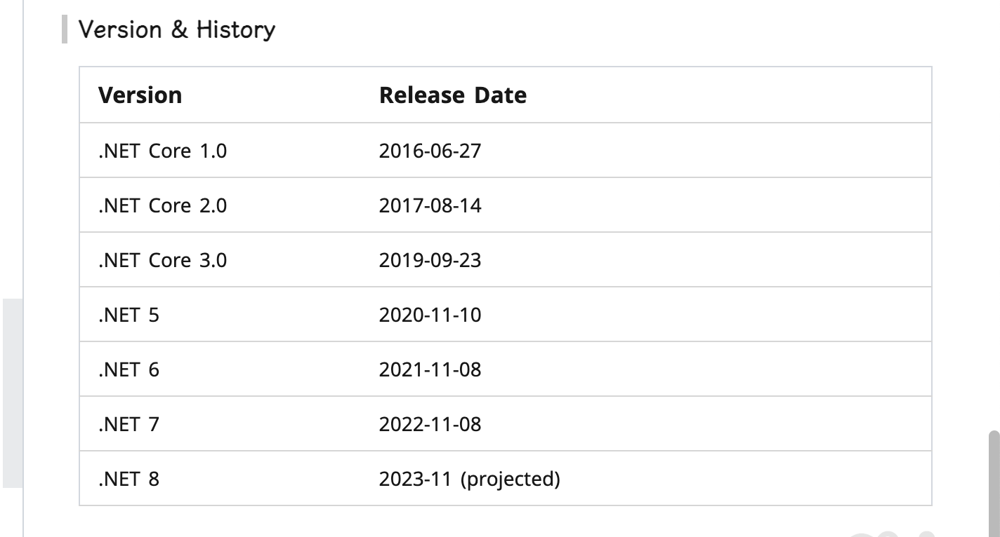
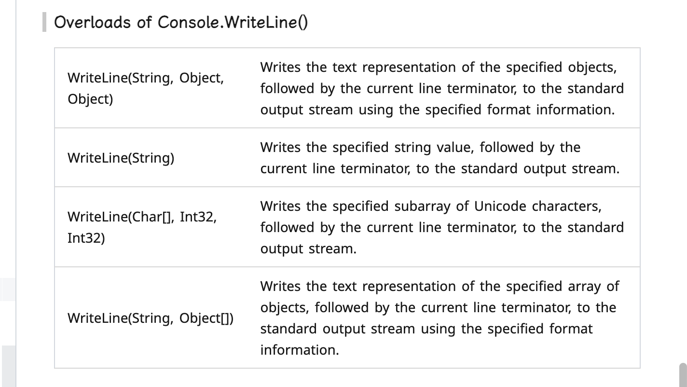

**By default, the first row (header) is hidden**. In my experience, headers are mostly redundant. If you want to use headers, add the `<htable></htable>`.

I also added symmetric tables, since symmetric two-column tables are quite common. Use `<dtable>` and `<dhtable>` to use the no-head and has-head versions respectively.

### Image
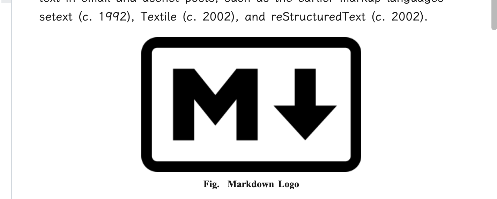

The image is centered and the size can be controlled (I insert the picture by HTML code).

usage:
```markdown
<div align=center class=img><br></div>
```

If you think it's troublesome to enter these string, you can use the VSCode's Snippets to make template. But I recommend using [Paste Image](https://marketplace.visualstudio.com/items?itemName=mushan.vscode-paste-image&ssr=false#overview) plugin to paste pictures directly.

### Code
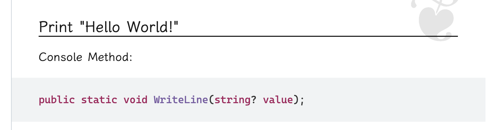

The code style is basically copy-pasted from [Google Protocol Buffers Doc](https://developers.google.com/protocol-buffers), but I made some modifications.

### BlockQuote
**note**:
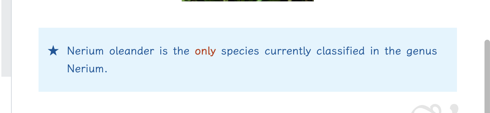

**warning**:
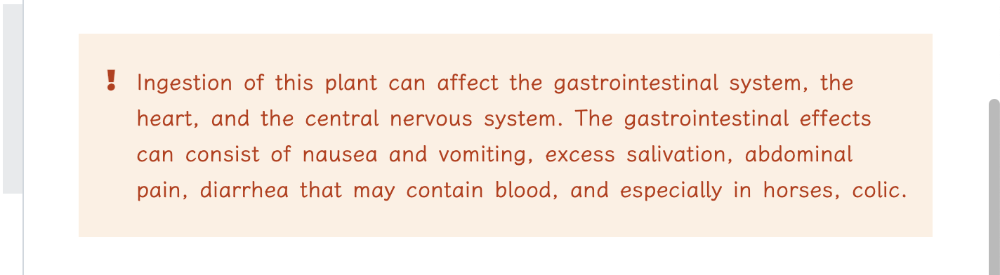

**ref**:
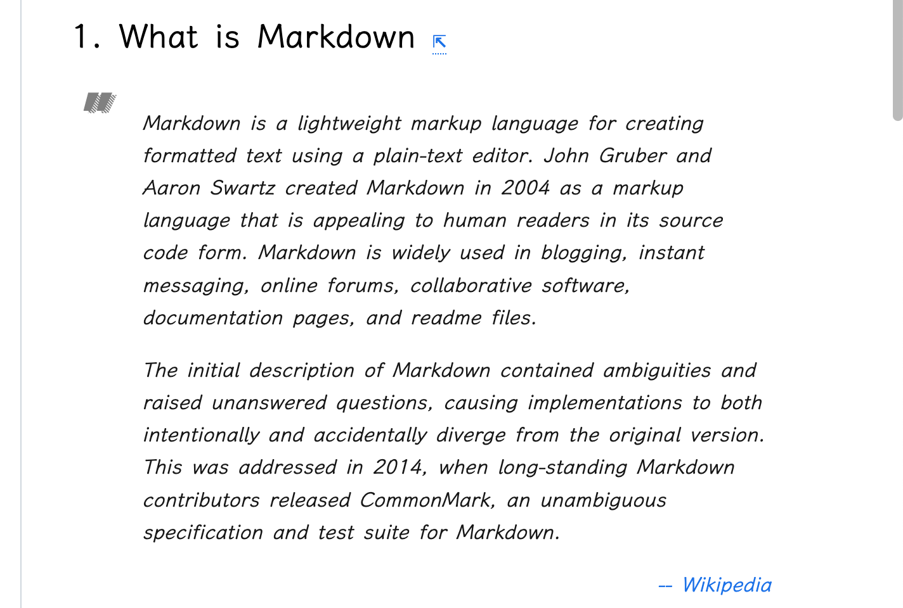

### Fold Block
**close**:
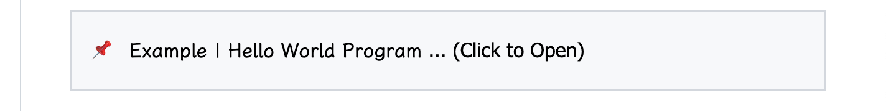

**open**:
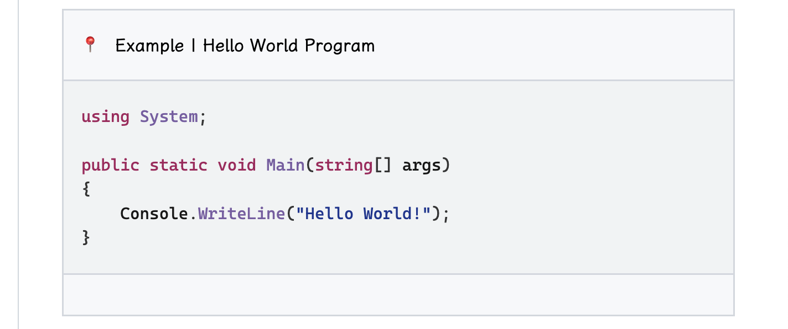


### Other
- Page width is fixed to 936px
- The horizontal margin is fixed at 40px
- Shadow of the page
- There are still some unexplained features, you can find out by looking at the CSS :D


## Other Information

- I personally use Chinese 90% of the time, so this style may look prettier in Chinese documents

### Suggestion
- Take more notes (including students and office workers)
- Use powerful screenshot software (such as: Snipaste)
- Paste images by plugin (such as: [Paste Image](https://marketplace.visualstudio.com/items?itemName=mushan.vscode-paste-image&ssr=false#overview))
- Format table by plugin (such as: [Markdown Table Prettify](https://marketplace.visualstudio.com/items?itemName=darkriszty.markdown-table-prettify&ssr=false#overview))
- Edit text by vim (such as: Neovim for vscode)
- Use VSCode's Snippet to quickly enter template text
- Try to edit the style to meet your own aesthetics


<br>
<br>
<br>
<br>
<br>
<br>
---End---
