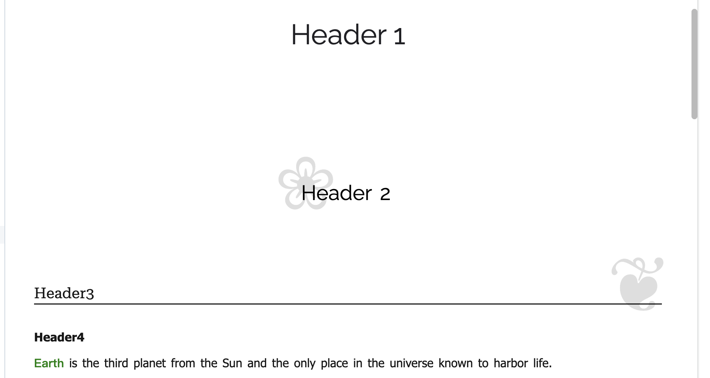
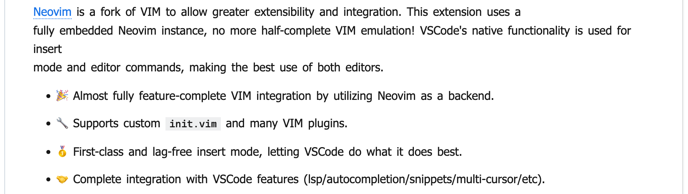
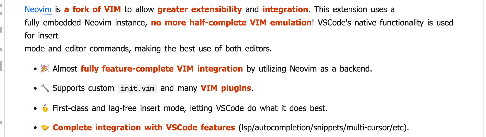
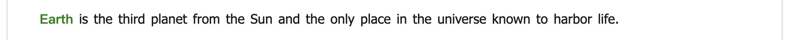
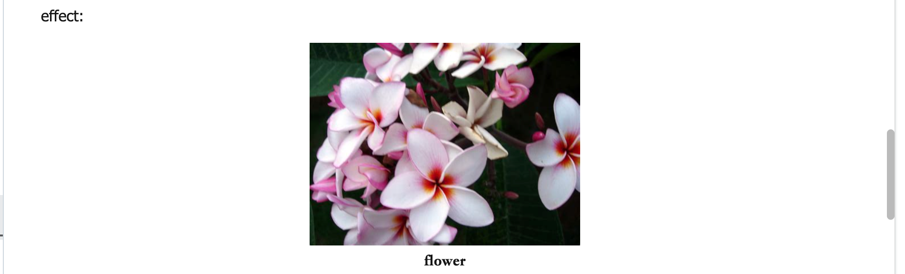
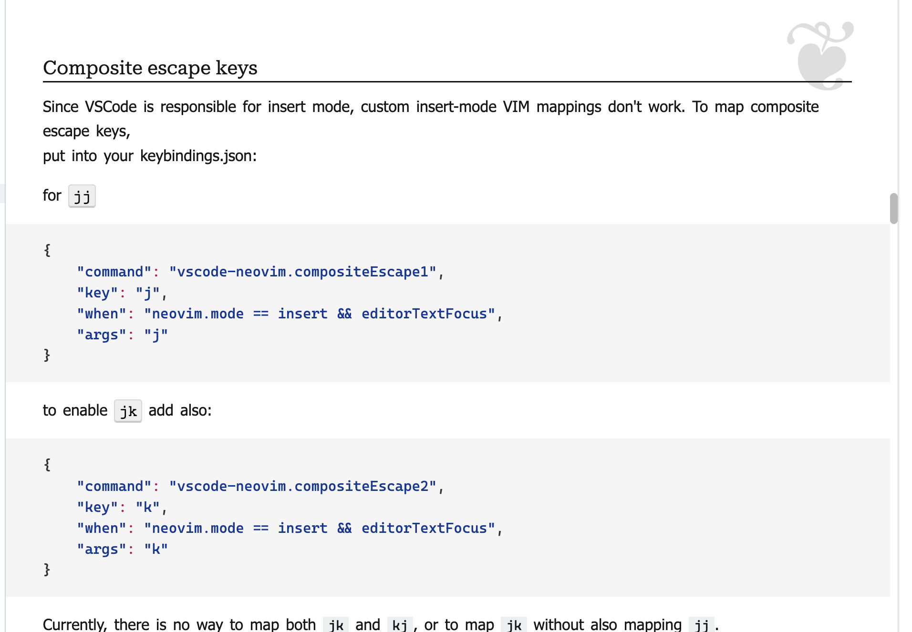
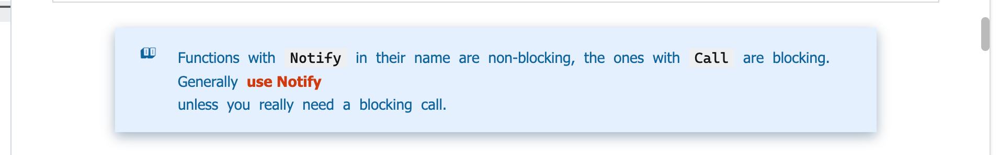
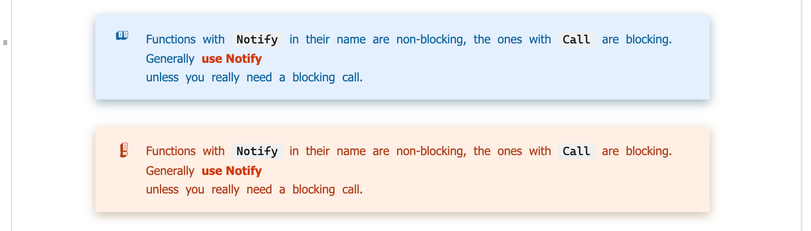
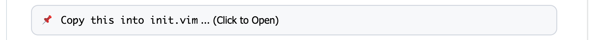
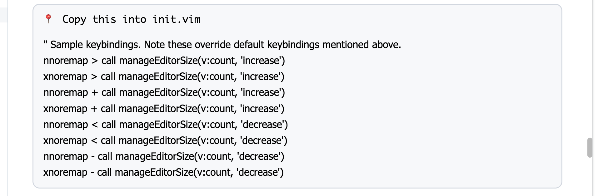

# Elegant-Markdown-Style

A self-use Markdown style (suitable for study notes, documents), used with [VSCode](https://code.visualstudio.com/) + [Markdown Preview Enhanced plug-in](https://github.com/shd101wyy/markdown-preview-enhanced).

The inspiration for the style comes mainly from the following websites:
- [Google Protocol Buffers Doc](https://developers.google.com/protocol-buffers)
- [MSDN Doc](https://learn.microsoft.com/en-us/dotnet/api/system?view=net-7.0)
- [LearnOpenGL CN](https://learnopengl-cn.github.io/)

p.s. I'm not good at english writing.

p.s. I'm not a front-end related worker, I just made this style out of interest. Pull requests is welcome.

p.s. This repository will update occasionally, and the pic below may not be updated in time.


## Install

### Install Fonts
- Raleway (Header1; Header2)
- Noto Sans (Body)
- Noto Sans Symbols2 (Marker of Header2 and Header 3; not required on macOS)
- Roboto Serif (Header3)
- Times New Roman (Image-Name)
- Cascadia Code (Code)
- Bungee Shade (Left Marker of Blockquote and Warning-Block)

Some fonts may be pre-installed on your system, go to the Fonts folder (Windows) or Font Book.app (macOS) to check.

These fonts may be found on Github or [Google Fonts](https://fonts.google.com/).

### Install Style
Please make sure you have installed VSCode and Markdown Preview Enhanced, how to install these things will not be explained here.

- Open VSCode
- <kbd>Ctrl</kbd>+<kbd>Shift</kbd>+<kbd>P</kbd> or <kbd>Cmd</kbd>+<kbd>Shift</kbd>+<kbd>P</kbd>
- Enter "Customize CSS" and select the first option, it would open a file called `style.less`
- Delete **everything** in the `style.less`
- Copy **everything** from [my custom style](src/Customize%20CSS.less), and paste into `style.less`
- Save file


## Feature

p.s. The pictures shown below are screenshots from my macbook

p.s. I downloaded README.md from [Neovim for VSCode](https://github.com/vscode-neovim/vscode-neovim/blob/master/README.md) as presentation text (because this doc use a lot Markdown's features). You can directly compare Github style and my style (picture below).

### Custom Header

p.s. This style only uses up to 4th level header



### Custom Font

Normal:


Bold (red text):


#### Definition
Bold effect is usually enough for text which need attention, but I've added a "Special Bold" to mark "concepts" that appear first time in context, which is useful for documentation and notes.

usage:
```markdown
<def>Earth</def> is the third planet from the Sun and the only place in the universe known to harbor life.
```

effect:


### Custom Table
The table of this style is inspired by MSDN. This table has a fixed maximum width and can cover the entire page horizontally, and the width of the first column always be 33% of current page.

**By default, the first row (header) is hidden**. In my experience, headers are mostly redundant. If you want to use headers, add the `<htable></htable>` tag:
```markdown
<htable>

| head1    | head2    |
|----------|----------|
| content1 | content2 |
</htable>
```

effect:


### Image Style
The image is centered and the size can be controlled (I insert the picture by HTML code)

usage:
```markdown
<div align=center class=img></br></div>
```

If you think it's troublesome to enter these string, you can use the VSCode's Snippets to make template. But I recommend using [Paste Image](https://marketplace.visualstudio.com/items?itemName=mushan.vscode-paste-image&ssr=false#overview) plugin to paste pictures directly

#### Image Name

Add a name under the picture.

usage:
```markdown
<div align=center class=img></br>flower</div>
```

effect:


### Custom Code Block

The code style is basically copy-pasted from [Google Protocol Buffers Doc](https://developers.google.com/protocol-buffers), but I made some modifications.

effect:


### Custom Block Quote

usage:
```markdown
>- Text...
```

Note that **NOT** `>` at the beginning, but `>-`. This is done to add a marker at the beginning (actually a list marker). This style is very common.

effect:


### Warning Block

Just a variant of Block Quote for warning content.

usage:
```markdown
<div class=warning><ul><li>

Warning! Warning!
</li></ul></div>
```

Note that there is an **empty line** here. If the content contains any Markdown's feature (such as bold text: \*\*abc\*\*), then you must have an empty line above content to display normally. On the other hand, if your content not using any Markdown's feature (HTML tag is ok), then this empty line is not necessary.

effect:


### Fold Block

The `details` tag from HTML.

usage:
```markdown
<details><summary>Title</summary>

Content
</details>
```

example:
```markdown
<details><summary>Copy this into init.vim</summary>

" Sample keybindings. Note these override default keybindings mentioned above.
nnoremap <C-w>> <Cmd>call <SID>manageEditorSize(v:count, 'increase')<CR>
xnoremap <C-w>> <Cmd>call <SID>manageEditorSize(v:count, 'increase')<CR>
nnoremap <C-w>+ <Cmd>call <SID>manageEditorSize(v:count, 'increase')<CR>
xnoremap <C-w>+ <Cmd>call <SID>manageEditorSize(v:count, 'increase')<CR>
nnoremap <C-w>< <Cmd>call <SID>manageEditorSize(v:count, 'decrease')<CR>
xnoremap <C-w>< <Cmd>call <SID>manageEditorSize(v:count, 'decrease')<CR>
nnoremap <C-w>- <Cmd>call <SID>manageEditorSize(v:count, 'decrease')<CR>
xnoremap <C-w>- <Cmd>call <SID>manageEditorSize(v:count, 'decrease')<CR>
</details>
```

effect:




### Other

- Page width is fixed to 936px
- The horizontal margin is fixed at 40px
- Shadow of the page
- Find yourself :D


## Other Information

- I personally use Chinese 90% of the time, so this style may look prettier in Chinese documents

### Suggestion
- Take more notes (including students and office workers)
- Use powerful screenshot software (such as: Snipaste)
- Paste images by plugin (such as: [Paste Image](https://marketplace.visualstudio.com/items?itemName=mushan.vscode-paste-image&ssr=false#overview))
- Format table by plugin (such as: [Markdown Table Prettify](https://marketplace.visualstudio.com/items?itemName=darkriszty.markdown-table-prettify&ssr=false#overview))
- Edit text by vim (such as: Neovim for vscode)
- Use VSCode's Snippet to quickly enter template text
- Try to edit the style to meet your own aesthetics


</br>
</br>
</br>
</br>
</br>
</br>
---End---
