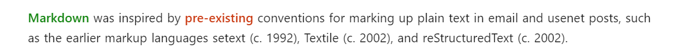
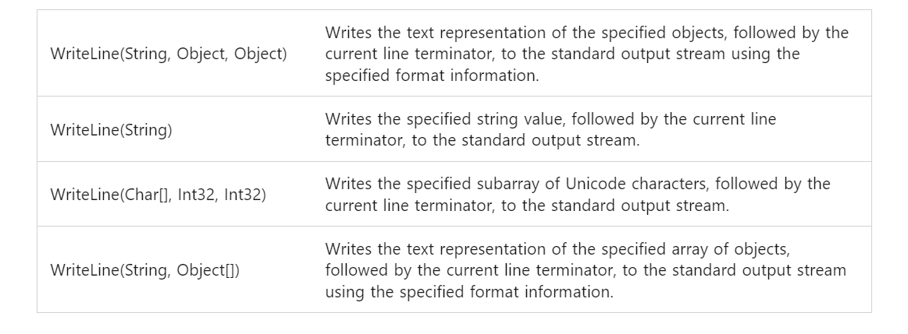

# Elegant-Markdown-Style

A self-use Markdown style (suitable for study notes, documents), used with [VSCode](https://code.visualstudio.com/) + [Markdown Preview Enhanced plug-in](https://github.com/shd101wyy/markdown-preview-enhanced).

The inspiration for the style comes mainly from the following websites:
- [Google Protocol Buffers Doc](https://developers.google.com/protocol-buffers)
- [MSDN Doc](https://learn.microsoft.com/en-us/dotnet/api/system?view=net-7.0)
- [LearnOpenGL CN](https://learnopengl-cn.github.io/)

p.s. This repository will update occasionally, and the pic below may not be updated in time.

p.s. As a developer (and user), I personally use notes mixed with Chinese and English, and use it under different resolutions and ppi. I personally think it performs well in most situations.


## Install

### Install Fonts
Search "font-family" in [Thin-Style.less](src/Thin-Style.less) and download it from the Internet by yourself. Some of these fonts may be found on Github or [Google Fonts](https://fonts.google.com/).

### Install Style
Please make sure you have installed **Markdown-Preview-Enhanced Plugin** on vscode. Then follow below steps:
- <kbd>Ctrl</kbd>+<kbd>Shift</kbd>+<kbd>P</kbd> (or <kbd>Cmd</kbd>+<kbd>Shift</kbd>+<kbd>P</kbd> on mac)
- Enter "Customize CSS" and select the first option, it would open a file called `style.less`
- Delete **everything** in `style.less`
- Copy **everything** in [Thin-Style.less](src/Thin-Style.less) (or [Thin-Style-Windows.less](src/Thin-Style-Windows.less) on windows)
- Paste into `style.less`
- Save file


## Effect Display

Screenshots are taken from my 24-inch 2K monitor, may look different on other device (4K HDR is recommended for the best experience). Content in screenshots are from [sample.md](sample/sample.md).


### Header Element

**Header1**:


**Header2**:


**Header3**:


**Header4**:


### Paragraph


#### Bold and Definition Tag

Source:
```markdown
<def>Markdown</def> was inspired by **pre-existing** conventions for marking up plain text in email and usenet posts, such as the earlier markup languages setext (c. 1992), Textile (c. 2002), and reStructuredText (c. 2002).
```

Effect:


### Table

Source:
```markdown
a                                 | b
----------------------------------|-----------------
WriteLine(String, Object, Object) | Writes the text representation of the specified objects, followed by the current line terminator, to the standard output stream using the specified format information.
WriteLine(String)                 | Writes the specified string value, followed by the current line terminator, to the standard output stream.
WriteLine(Char[], Int32, Int32)   | Writes the specified subarray of Unicode characters, followed by the current line terminator, to the standard output stream.
WriteLine(String, Object[])       | Writes the text representation of the specified array of objects, followed by the current line terminator, to the standard output stream using the specified format information.
```

Effect:


**By default, the first row (header) is hidden**. In my experience, headers are mostly redundant. If you want to use headers, add the `<htable></htable>`. Additionally, there are other tags of Table, you may try to find out their effects.

### Image

Source:
```markdown
<div align=center class=img><br><fig>Nerium Oleander</fig></div>
```

Effect:


Indeed, it's troublesome to input these string, you can use the VSCode's Snippets to make template. Or use (which I recommend) [Paste Image](https://marketplace.visualstudio.com/items?itemName=mushan.vscode-paste-image&ssr=false#overview) plugin to paste pictures directly.

### Code


The code style is basically copy-pasted from [Google Protocol Buffers Doc](https://developers.google.com/protocol-buffers), but I made some modifications.

### BlockQuote
Source:
```markdown
> Nerium oleander is the **only** species currently classified in the genus Nerium.

<div class=warning>

Nerium oleander is the **only** species currently classified in the genus Nerium.
</div>
```

Effect:


### Fold Block
Source:
```markdown
<details><summary>Example | Hello World Program</summary>

```csharp
using System;

public static void Main(string[] args)
{
    Console.WriteLine("Hello World!");
}
```
</details>
```

Effect:


### Other
- Page has fixed width
- Page has fixed horizontal margin
- There are still some unexplained details, you can find out by look at the source :D


<br>
<br>
<br>
<br>
<br>
<br>
---End---
