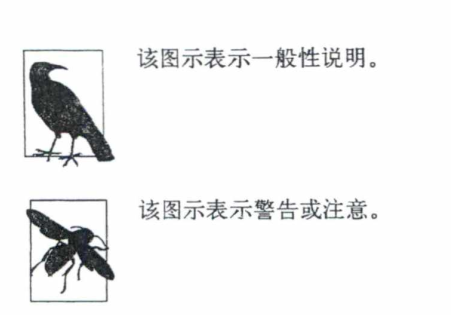

# Markdown Draft Title 3D Plane 标题


## Introduction 介绍

{width="30%"}

[table: title="这是表格的标题 title"; header="true"; twidth="narrow"; layout="half"; textalign="center"]
a       | b
--------|---------
jijisdf | jisjdijf

哦~~哦~~哦，测试绕过 Flanking Delimiter 规则~~,okokok,）~~测试。

你好，**我我我）**很好的一天

### Header 3.0 LLM llm

==what the ?== ok, ==hello world==。

- 测试 Details 块

  {width="30%"}
  ::: details open 折叠块测试
  {width="30%"}
  你好啊
  $$测试$$
  :::
  背后有东西
  ::: details 折叠块测试
  good
  :::

  ::: details 折叠块测试
  sdf
  :::
  ::: details open 折叠块测试
  :::

#### Header4

- sjdifj

  [table: header="true"; title="这是表格的标题 title"; layout="half"]
  a    | b
  -----|------------
  okok | show header

#### Header4
OK, Header4.

### Header 3.1
<!-- jisjdifjidjsidjf -->

- TestTest
- [ ] TestTest
1. TestTest

   {width="30%"}

   {width="30%"}

1. Holy
   > [!TIP]
   > Test
- [ ] TestTest

  > Test

好了好了

> [!IMPORTANT]
> Key information users need to know to achieve their goal.

> [!WARNING]
> Urgent info that needs immediate user attention to avoid problems.

> [!WARNING]
> Urgent info that needs immediate user attention to avoid problems.

> [!NOTE]
> Test Content
> $what the hell$

> [!TIP]
> Helpful advice for doing things better or more easily.

> [!WARNING]
> Urgent info that needs immediate user attention to avoid problems.

> [!CAUTION]
> Advises about risks or negative outcomes of certain actions.

- HHH

##### HHH

> [!CAUTION]
> Advises about risks or negative outcomes of certain actions.

> okok

==jisjdifj== okok

```
sjidjifj
```

> Huge Blockquote
> 当我们在讨论向量长度、方向、夹角...时，都必须有一个基。若未说明，则**默认**以 $E$ 为基，该约定适用于所有笔记。在涉及其他基的讨论时，该约定非常重要，如有必要可以给名词加上“自然”作为前缀（如：自然长度、自然角度、自然坐标...），以区分在其他基的情况

##### HHH

- Inside a list

  [list: style="table"]
  - A

    Content `sudo`

    $$f(x) = a + b$$

    ```
    代码块呢，我测我测
    just a test code.

    code is fine
    ```

    {width="30%"}

  - B
  - C

[list: style="table"]
- A，A Very Long Content A Very Long Content A Very Long Content A Very Long Content A Very Long Content A Very Long Content A Very Long Content A Very Long Content A Very Long Content
- B
- C
- D

[list: style="table"]
1. 这是有序的版本 A Very Long Content A Very Long Content A Very Long Content A Very Long Content

   可能有内容，也可能没有

1. 好吧

    A Very Long Content A Very Long Content A Very Long Content A Very Long Content A Very Long Content A Very Long Content

1. 猜猜会发生什么

##### HHH

jisjdifj

```
sjidjifj
```

##### HHH

##### HHH

1. jisjdijf


<br>
<br>
<br>
<br>
<br>
<br>

---End---

